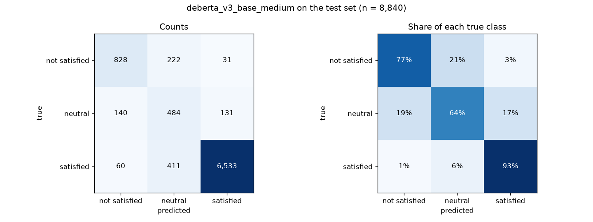

# Amazon Review Sentiment Analysis

[](LICENSE)
[](https://www.python.org/downloads/)
[](https://github.com/AnthonyGedeon04/Amazon-Review-Sentiment-Analysis/actions/workflows/tests.yml)

Classifies Amazon Echo Dot 2 reviews as **satisfied**, **neutral**, or **not satisfied**, using labels derived from star ratings (4-5, 3, 1-2).

**Final model:** DeBERTa-v3 base, macro-F1 **0.752** and accuracy **0.887** on 8,840 held-out reviews, ahead of the best classical model (TF-IDF + logistic regression, 0.711). A small Flask web app lets you type a review and see the prediction.

## Project layout

```
amazon-review-sentiment/
├── Data/           put the Kaggle CSV here; notebook 01 creates train.csv / test.csv (see Data/README.md)
├── Notebooks/      01_data_prep_and_baseline.ipynb, 02_classical_models, 03_transformer_models, 04_compare_and_select, 05_retrain_top_models, 06_deberta_second_epoch, 07_final_evaluation
├── Output/         results JSON (results/), charts; results_v1_text_only/ = first round, text only
├── Requirements/   requirements.txt, requirements-transformer.txt, requirements-app.txt
├── app/            Flask web app (see app/README.md)
├── tests/          automated tests for predict.py and the web app (see Tests)
└── predict.py      predict sentiment for new reviews with the final model
```

The trained transformer models (`Output/models/`) are several hundred MB each, too big for GitHub. To use `predict.py` or the web app, recreate the final model with notebook 05 (see [Web app](#web-app)).

## Dataset

- Source: [Amazon Echo Dot 2 Reviews Dataset](https://www.kaggle.com/datasets/PromptCloudHQ/amazon-echo-dot-2-reviews-dataset) on Kaggle (PromptCloud). The CSV files are not included here; [Data/README.md](Data/README.md) says how to get them.
- 53,048 reviews of a single product (Amazon Echo Dot 2), Oct 2016 to Oct 2017.
- After removing empty and duplicate reviews: 44,200. Stratified 80/20 split: 35,360 train, 8,840 test.
- Heavily imbalanced: about 80% satisfied, 12% not satisfied, 8% neutral. Models use class weights and are judged by **macro-F1**, since always predicting "satisfied" already gets about 80% accuracy.
- Review titles are used together with the text. Amazon's automatic titles ("Five Stars", "One Star", ...) are blanked in notebook 01 because they give the label away; titles the reviewer actually wrote are kept (about 29% of reviews end up with no title).

## Notebooks

Run them in order. Every model uses the same `Data/train.csv` / `Data/test.csv` split and writes its scores to `Output/results/`.

| Notebook | What it does | Where to run |
|---|---|---|
| `01_data_prep_and_baseline` | cleaning, train/test split, TF-IDF baseline | any laptop, ~1 min |
| `02_classical_models` | 7 classical models (Naive Bayes, logistic regression, SVM, ...) | any laptop, ~10 min (5-fold cross-validation for the cutoff adjustment) |
| `03_transformer_models` | fine-tunes DistilBERT, BERT, RoBERTa, DeBERTa-v3 and a sentiment-pretrained RoBERTa with identical settings | best with an NVIDIA GPU; CPU preset available |
| `04_compare_and_select` | ranks everything, charts it, picks the winner | any laptop |
| `05_retrain_top_models` | retrains the two best lite transformers (DeBERTa-v3, twitter-RoBERTa) on 3x more data (`medium` preset); re-run 04 afterwards | laptop CPU, about 5 to 6 h |
| `06_deberta_second_epoch` | tests a second epoch for the winner, DeBERTa-v3 (result: 0.738, no improvement over 1 epoch); re-run 04 afterwards | laptop CPU, about 4 to 6 h |
| `07_final_evaluation` | final model in detail: classification report, confusion matrix, accuracy per star rating, example right and wrong predictions | laptop CPU, about 20 to 40 min the first time |

**Selection rule:** highest macro-F1 on the test set. If models are within 0.01, prefer higher neutral recall (the hardest class), then the smaller model.

## Results so far (test set, n = 8,840)

Every model gets the title + text as input and a **cutoff adjustment**: a small offset per class, chosen on held-out training data (5-fold cross-validation for classical models, a 1,500-review validation set with the real class mix for transformers) to maximise macro-F1, then applied unchanged to the test set.

| Model | Macro-F1 | Before cutoff adj. | Recall: not satisfied | Recall: neutral | Recall: satisfied |
|---|---|---|---|---|---|
| **DeBERTa-v3 base (medium)** | **0.752** | 0.730 | 0.77 | 0.64 | 0.93 |
| DeBERTa-v3 base (medium, 2 epochs) | 0.738 | 0.725 | 0.70 | 0.67 | 0.93 |
| twitter-RoBERTa sentiment (medium) | 0.733 | 0.720 | 0.71 | 0.63 | 0.93 |
| DeBERTa-v3 base (lite) | 0.719 | 0.704 | 0.76 | 0.53 | 0.93 |
| twitter-RoBERTa sentiment (lite) | 0.712 | 0.708 | 0.68 | 0.55 | 0.94 |
| TF-IDF + LogReg, unweighted | 0.711 | 0.639 | 0.68 | 0.57 | 0.93 |
| TF-IDF + LogReg, balanced | 0.706 | 0.698 | 0.73 | 0.54 | 0.92 |
| SGD (hinge), balanced | 0.705 | 0.702 | 0.67 | 0.57 | 0.93 |
| Word+char TF-IDF + LinearSVC, balanced | 0.701 | 0.705 | 0.62 | 0.59 | 0.93 |
| Word+char TF-IDF + LogReg, balanced | 0.701 | 0.697 | 0.68 | 0.54 | 0.93 |
| Multinomial Naive Bayes | 0.680 | 0.613 | 0.68 | 0.43 | 0.94 |
| Complement Naive Bayes | 0.679 | 0.647 | 0.66 | 0.47 | 0.93 |
| RoBERTa base (lite) | 0.672 | 0.669 | 0.59 | 0.42 | 0.96 |
| BERT base (lite) | 0.665 | 0.668 | 0.69 | 0.33 | 0.95 |
| DistilBERT (lite) | 0.657 | 0.660 | 0.65 | 0.36 | 0.94 |

*Lite* transformers were trained on 3,000 reviews (1,000 per class, notebook 03) and *medium* on 9,000 (3,000 per class, notebook 05), both for 1 epoch on a laptop CPU. More data lifted DeBERTa-v3 from 0.719 to 0.752 and twitter-RoBERTa from 0.712 to 0.733.

**Final model: DeBERTa-v3 base (medium)**, macro-F1 0.752 and accuracy 0.887. It leads the best classical model (TF-IDF + LogReg, 0.711) by 0.041, and it finds more neutral reviews (recall 0.64 vs 0.57). Its validation score was still rising at the end of the epoch, so notebook 06 retrained it with a second epoch. That did not help: validation macro-F1 peaked around the end of the first epoch (0.697, 0.716, 0.714, ...), and the test score came out at 0.738, lower than the 1-epoch model's 0.752 (the 2-epoch model finds a few more neutral reviews but fewer not-satisfied ones). **The 1-epoch DeBERTa-v3 (medium) is the final model**, saved in `Output/models/deberta_v3_base_medium`.

## Final model in detail (notebook 07)



| True label | Predicted not satisfied | Predicted neutral | Predicted satisfied |
|---|---|---|---|
| not satisfied (1,081) | **828 (77%)** | 222 (21%) | 31 (3%) |
| neutral (755) | 140 (19%) | **484 (64%)** | 131 (17%) |
| satisfied (7,004) | 60 (1%) | 411 (6%) | **6,533 (93%)** |

The model almost never confuses the two extremes: only 3% of unhappy reviews are called satisfied, and 1% the other way round. Nearly all its errors involve the neutral class, which sits between the two.

**Accuracy per star rating**, compared with the TF-IDF + LogReg baseline from notebook 01:

| Stars | Reviews | Final model | Baseline |
|---|---|---|---|
| 1★ | 625 | 86% | 81% |
| 2★ | 456 | 64% | 59% |
| 3★ | 755 | 64% | 57% |
| 4★ | 1,315 | 75% | 63% |
| 5★ | 5,689 | 98% | 95% |

The model is better at every star level, and the biggest gain is on 4★ (+12 points). The remaining errors sit on the borders: 33% of 2★ reviews and 23% of 4★ reviews are predicted neutral. Many of those are mixed reviews ("works fine, speaker is weak") where the star rating is a judgement call, so part of the gap is noise in the labels rather than model mistakes. Notebook 07 lists example errors.

First round (text only, no cutoff adjustment): best classical macro-F1 was 0.690; lite transformers reached 0.620 to 0.659, mostly because balanced training made them over-predict neutral. Those results are kept in `Output/results_v1_text_only/`.

## Setup in VS Code

1. Install the **Python** and **Jupyter** extensions.
2. Clone this repository (or download it as a ZIP), open the folder, download the dataset into `Data/` as described in [Data/README.md](Data/README.md), then create a virtual environment:
   ```bash
   python -m venv .venv
   # Windows: .venv\Scripts\activate    macOS/Linux: source .venv/bin/activate
   pip install -r Requirements/requirements.txt
   ```
3. Open `Notebooks/01_data_prep_and_baseline.ipynb`, choose the `.venv` kernel (top right), and **Run All**. It takes about a minute.

## Transformers (notebook 03)

Install the extra packages in the same `.venv`:

```bash
# NVIDIA GPU only: install the CUDA build of PyTorch first (pick your CUDA version at pytorch.org/get-started/locally), e.g.
pip install torch --index-url https://download.pytorch.org/whl/cu124
# everyone:
pip install -r Requirements/requirements-transformer.txt
```

Check what PyTorch sees: `python -c "import torch; print(torch.cuda.is_available())"`.

The notebook auto-detects NVIDIA CUDA, Apple Silicon (MPS) or CPU and picks a preset; change `PRESET` in the settings cell to override.

| Preset | Training data | Max length | Epochs | Rough time, all 5 models |
|---|---|---|---|---|
| `full` (auto with NVIDIA GPU) | all ~33,900 reviews | 256 | 3 | ~2-4 h on a GPU |
| `lite` (auto on CPU / Apple Silicon) | 3,000 (1,000 per class) | 64 | 1 | ~3 to 3.5 h on a Windows laptop CPU |
| `medium` | 9,000 (3,000 per class) | 64 | 1 | about 3x `lite`; for retraining the best lite models |
| `cpu` | 9,000 (3,000 per class) | 128 | 2 | many hours on a laptop |
| `smoke` | 600 | 64 | 1 | minutes; only checks it runs |

These times are estimates; your first progress bar shows the real speed. Running `full` on a CPU is possible but would take roughly a day or more. All presets score on the full test set. Notebook 04 flags any model that wasn't trained with `full`, since those scores likely understate what the model can do.

Results are saved per model as they finish, and finished models are skipped on re-run, so you can stop and continue later. The first run downloads each pretrained model (~250-750 MB each) from Hugging Face.

## Predicting new reviews

`predict.py` loads the final model (`Output/models/deberta_v3_base_medium`) with the same title + text input and cutoff adjustment used for the reported score. From the project folder, with the transformer packages installed:

```bash
python predict.py "Stopped working after two weeks"
python predict.py "Works fine, speaker is weak" --title "It's ok"
python predict.py --file my_reviews.csv    # needs a 'text' column; writes my_reviews_predictions.csv
```

Or from Python:

```python
from predict import SentimentModel
model = SentimentModel()
model.predict(["Love it!", "Stopped working after a week"])
```

## Web app

`app/` holds a small Flask app: type a review (and an optional title), click **Analyze**, and it shows *not satisfied*, *neutral* or *satisfied* with a bar per class. It uses `predict.py`, so it gives the same answers as the command line and notebook 07.

The app needs the final model in `Output/models/deberta_v3_base_medium/`. It isn't in this repository because it is too big for GitHub, so create it first by running notebooks 01 and 05 (notebook 05 takes about 5 to 6 hours on a laptop CPU). Then, from the project folder:

```powershell
pip install -r Requirements/requirements-app.txt
python app/app.py
```

Wait for `Model ready`, then open <http://127.0.0.1:5000>. More details and the API are in [app/README.md](app/README.md).

## Tests

`tests/` checks `predict.py` and the web app: the input format, that probabilities add up to 1, that the cutoff offsets change the prediction, and that the API returns a label with a score per class and rejects empty or too-long reviews. The tests use a tiny randomly initialised stand-in model, so they run in a few seconds without the trained DeBERTa. GitHub Actions runs them on every push (the **tests** badge at the top). To run them yourself:

```bash
pip install -r Requirements/requirements-app.txt pytest
pytest
```

## License

This project is released under the [MIT License](LICENSE).
